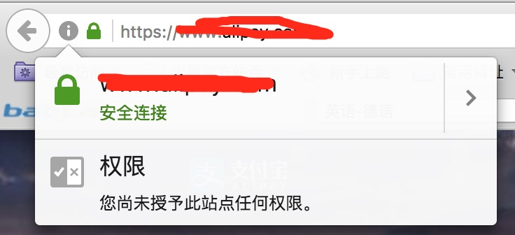
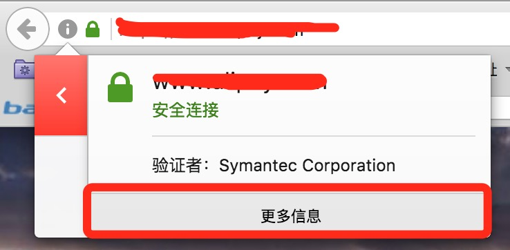
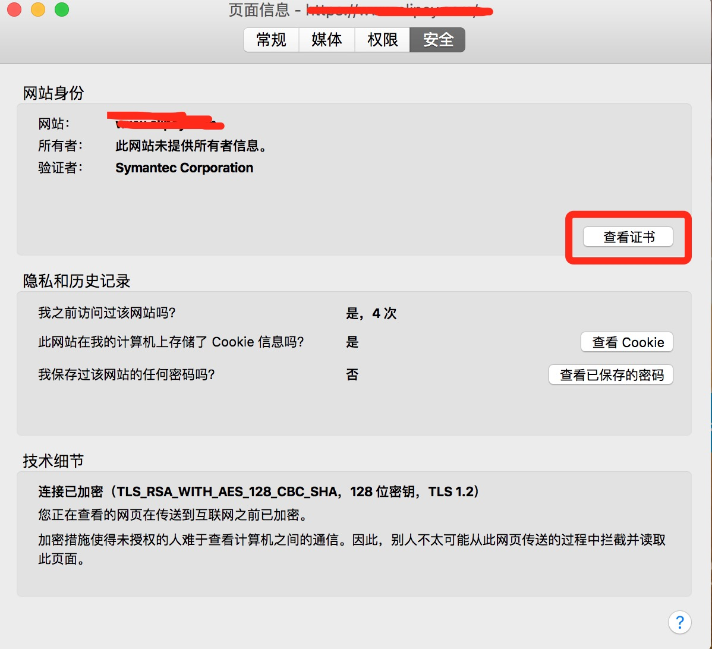
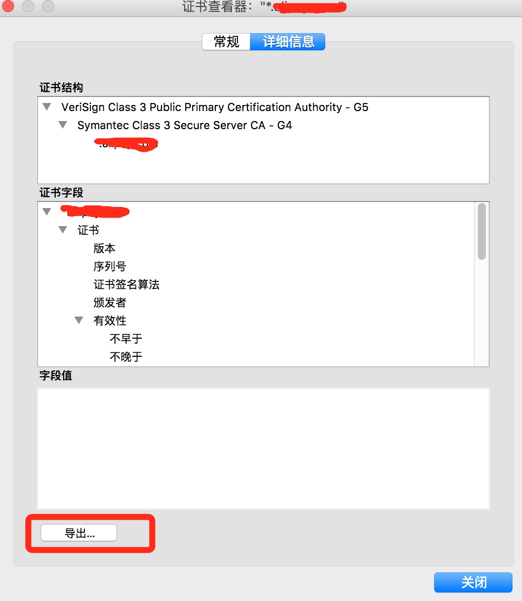
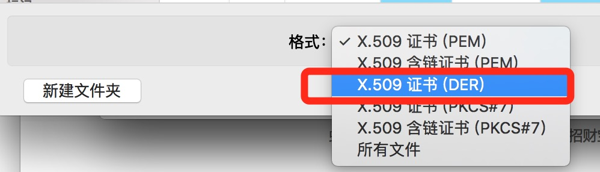

# 关于https客户端证书
客户端需要做https证书验证的话，那么需要导入一个客户端证书，每次请求接口的话，用来跟服务端做验证，最新的AF验证https的证书格式要求为der的格式，但是其实cer的格式也是可以的。怎么获取证书呢？一般有两种方式 一般服务端给你的是一个pfx格式结尾的证书，我们可以通过OpenSSL命令导出我们所需要的证书。还有一种我们可以直接通过浏览器访问我们的域名获取客户端所需要的证书。

####1、OpenSSL命令导出证书

先导出pem证书

```
openssl pkcs12 -in certificate.pfx -out certificate.cer -nodes

```
在执行这个命令的时候会让你输入密码，输入密码即可


####2、通过浏览器获取

1、浏览器输入网址，图例为火狐浏览器



2、查看详情信息



3、点击查看更多信息



4、选择最下面的.com的域名导出



5、选择证书格式导出保存完成



